# DIY-LLM

Just a pet project of mine to learn the inner workings of LLMs and PyTorch. The goal is to end up with a small LLM I've trained myself (however bad it may be).

## Data Download

Because I only have so much RAM, the data is downloaded from Dolma, extracted, and split into individual files of size `--max-file-size-mb` (default of 512MB).

```bash
python src/download_training_data.py --data-dir data/ --extract --limit 5 --random --max-file-size-mb 512
```

This will create a directory structure like this:

```text
data/
├── <filename>_part001.json
├── <filename>_part002.json
├── ...
└── <filename>_partNNN.json
```

During training, the dataloader in `src/dataloader.py` loads these files and tokenizes them iteratively, inheriting from `IterableDataset` to hopefully keep memory overhead low.

## Model Architecture

The model follows the GPT-2 Small architecture with the following specifications:

```mermaid
graph TD
    subgraph GPT2_Small_124M["GPT-2 Small (124M Parameters)"]
        Input[("Input Tokens<br/>(Sequence Length: 1024)")]
        
        subgraph Embedding_Layer["Embedding Layer"]
            Token_Emb["Token Embedding<br/>(50,257 × 768)"]
            Pos_Emb["Positional Embedding<br/>(1024 × 768)"]
        end
        
        subgraph Transformer_Blocks["12x Transformer Block"]
            TB1[("Multi-Head Attention<br/>(12 heads, 64 dim/head)")]
            TB2[("Add & Layer Norm<br/>(LayerNorm + Residual)")]
            TB3[("Feed Forward<br/>(3072 hidden units)")]
            TB4[("Add & Layer Norm<br/>(LayerNorm + Residual)")]
            TB_Continue[("...")]
            TB12[("Block 12")]
        end
        
        Final_LayerNorm[("Final Layer Norm")]
        Linear_Layer["Linear Layer<br/>(768 -> 50,257)"]
        Output[("Output Logits<br/>(50,257 vocabulary)")]
        
        Input --> Token_Emb
        Input --> Pos_Emb
        Token_Emb --> Add1[("\+")]
        Pos_Emb --> Add1
        Add1 --> Dropout1["Dropout (10%)"]
        Dropout1 --> TB1
        TB1 --> TB2
        TB2 --> TB3
        TB3 --> TB4
        TB4 --> TB_Continue
        TB_Continue --> TB12
        TB12 --> Final_LayerNorm
        Final_LayerNorm --> Linear_Layer
        Linear_Layer --> Output
    end
```



### Key Components

- **Embedding Layer**: Combines token and positional embeddings
- **12x Transformer Blocks**: Each with multi-head attention and feed-forward networks
- **Layer Normalization**: Applied before attention and feed-forward layers
- **Residual Connections**: Added around each sub-layer
- **Dropout**: 10% dropout on embeddings and attention weights
- **Context Length**: 1024 tokens
- **Embedding Dimension**: 768
- **Attention Heads**: 12 (64 dimensions per head)
- **Feed-Forward Dimension**: 3072 (4x embedding dim)
